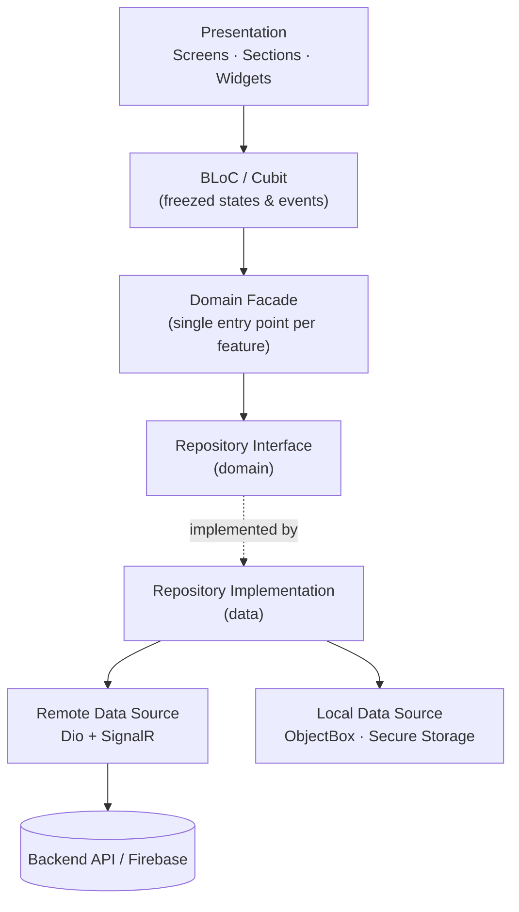

# customertaxi

A Flutter rider app for on-demand taxi booking — live map-based ordering, real-time trip tracking, and in-app payments, built with Clean Architecture.


## Overview

**customertaxi** is the passenger-facing side of a taxi-hailing platform. Riders drop pins or search for an address on a full-screen map, get real-time fare quotes for multiple car classes, and book a trip — with support for multi-stop routes, scheduled rides, and airport pickups. Once booked, the trip is tracked live end-to-end, with in-app chat to the driver and card or wallet checkout at the end.

The app follows a strict Clean Architecture layout across every feature, generates most of its boilerplate (DI, models, routing assets) at build time, and ships with its own architecture-conformance check that runs in CI.

## Features

**Booking & Trips**
- 🗺️ Full-screen map booking flow with a search-pill overlay for pickup/drop-off
- 📍 Address search with saved-location suggestions and location bias
- 🧭 Multi-stop trips, scheduled rides, and airport pickup with flight-number capture
- 🚗 Real-time fare quotes across multiple car/service options
- 📡 Live trip tracking over a SignalR real-time connection
- 💬 In-trip chat with the driver
- 🕓 Trip history

**Payments & Wallet**
- 💳 Card checkout via the Stripe Payment Sheet
- 👛 In-app wallet with balance top-up and saved cards
- 🔀 Mixed payment (wallet + card)
- 🧾 Invoice preview (PDF) with share/download
- ↩️ Refund issue submission with live status updates from the backend

**Account**
- 🔐 Phone number + OTP sign-in via Firebase Auth, plus Google Sign-In
- 🪪 JWT session with silent token refresh
- 👤 Profile management with photo upload

**Platform & UX**
- 🌍 9-language localization
- 🔔 Push notifications (Firebase Cloud Messaging) + local notifications
- 🆙 First-launch onboarding carousel
- 🔁 Force-update and soft-update prompts
- 📐 Fully responsive layout (screen-size-aware sizing throughout)
- 🕵️ Device Preview support for multi-device QA

**Security**
- 📌 TLS certificate pinning (SHA-256 fingerprint validation)
- 🔒 Compile-time secret obfuscation for environment values
- 🗄️ Secure storage for session tokens

## Tech Stack

| Layer | Technology |
| --- | --- |
| Framework | Flutter, Dart SDK `^3.10.1` |
| State management | `bloc` / `flutter_bloc` 9 + `freezed` (immutable, exhaustive states) |
| Dependency injection | `injectable` + `get_it` (code-generated container) |
| Routing | `go_router` |
| Networking | `dio` + `dio_refresh_bot` (silent auth refresh) + certificate pinning |
| Local storage | `objectbox`, `flutter_secure_storage`, `shared_preferences` |
| Maps & location | `google_maps_flutter`, `geolocator`, `flutter_polyline_points` |
| Real-time | `signalr_netcore` |
| Payments | `flutter_stripe` (Payment Sheet) |
| Auth & backend | `firebase_auth`, `firebase_core`, `google_sign_in` |
| Push notifications | `firebase_messaging`, `flutter_local_notifications` |
| Localization | `easy_localization` (9 locales) |
| Forms | `reactive_forms` |
| Responsive UI | `flutter_screenutil` |
| Env / secrets | `envied` (compile-time obfuscation) |
| Code generation | `build_runner`, `freezed`, `json_serializable`, `injectable_generator`, `flutter_gen`, `objectbox_generator` |
| CI/CD | GitHub Actions (analyze, test, architecture check, build) + Codemagic (signed Android release / closed testing) |

## Architecture

The app follows **Clean Architecture** on a per-feature basis. Every feature under `lib/features/` is sliced into `data`, `domain`, and `presentation` layers, each with a single, predictable responsibility:

- **`presentation`** — Screens → Sections → Widgets, driven by a BLoC/Cubit that exposes `freezed` states. Async operations are rendered through a status wrapper (initial / loading / success / failure) so the UI never blocks on ambiguous state.
- **`domain`** — Pure entities and repository interfaces, exposed to the presentation layer through a single facade per feature. No dependency on Flutter or data-layer details.
- **`data`** — Repository implementations, remote data sources (Dio-backed HTTP + SignalR), local data sources (ObjectBox / secure storage), and mappers that translate models to domain entities.

Cross-cutting concerns (dependency injection, routing, networking, theming, notifications, session handling, local persistence, permissions) live under `lib/core/`, and shared UI building blocks live under `lib/common/`. A dedicated script (`tool/verify_architecture.dart`) enforces this layout in CI so the structure can't silently drift.



## Project Structure

```text
customertaxi/
├── lib/
│   ├── bootstrap.dart        # Strictly-ordered app startup
│   ├── app.dart               # Root widget, theming, localization wiring
│   ├── flavors.dart           # Stage / production flavor definitions
│   ├── firebase_options.dart  # FlutterFire-generated platform config
│   ├── common/                 # Shared widgets, buttons, forms, scaffolds
│   ├── core/                   # DI, router, networking, theming, services
│   │   ├── config/              # App config, env (envied), localization config
│   │   ├── injection/           # get_it + injectable container
│   │   ├── network/              # Dio client, interceptors, certificate pinning
│   │   ├── router/                # go_router config, route guards
│   │   └── services/               # Session, location, permissions, realtime, payments, etc.
│   ├── features/               # One folder per feature (data/domain/presentation)
│   │   ├── auth/  order/  trip/  chat/  payment/
│   │   ├── refund_issues/  profile/  favorites/
│   │   └── root/  splash/  onboarding/  permissions/  app_update/
│   └── utils/                   # Design tokens, constants, extensions, generated code
├── assets/
│   ├── l10n/                    # 9 translation files
│   ├── images/  svgIcons/  icons/
├── tool/                        # Feature scaffolder, translation sync, architecture check
├── android/  ios/                 # Platform projects
└── pubspec.yaml
```

## Getting Started

### Prerequisites

- Flutter (stable channel) — CI is pinned to Flutter `3.44.1`; Dart SDK `^3.10.1` per `pubspec.yaml`
- Android Studio / Xcode for platform builds
- A Firebase project with phone authentication enabled (platform config files are already checked into `android/app/google-services.json` and `ios/Runner/GoogleService-Info.plist`)
- A Google Maps API key
- A running backend API to point the app at

### Clone & install

```bash
git clone git@github.com:fat7i-alghareeb/customer_taxi_app.git
cd customer_taxi_app
flutter pub get
```

### Environment configuration

Secrets are loaded at compile time via [`envied`](https://pub.dev/packages/envied) from a `.env` file at the project root (git-ignored). Create one with the keys declared in `lib/core/config/env/env.dart`:

```env
GOOGLE_MAPS_API_KEY=
STAGE_BASE_URL=
PRODUCTION_BASE_URL=
```

Then generate the obfuscated env class and the rest of the generated code (Freezed models, Injectable container, JSON serialization, ObjectBox schema, asset references):

```bash
dart run build_runner build --delete-conflicting-outputs
```

For native map rendering, also set the Google Maps key in:
- Android: `android/app/src/main/AndroidManifest.xml` → `com.google.android.geo.API_KEY`
- iOS: `ios/Runner/AppDelegate.swift` → `GMSServices.provideAPIKey(...)`

Stripe is configured remotely (fetched from backend client config at runtime), so no publishable key is needed locally.

### Run

The app ships two build flavors, `stage` and `production`, defined in `pubspec.yaml` (`flutter_flavorizr`) and read at runtime via Flutter's native flavor mechanism:

```bash
flutter run --flavor stage
flutter run --flavor production
```

### Useful commands

| Task | Command |
| --- | --- |
| Regenerate Freezed / Injectable / JSON / ObjectBox / assets | `dart run build_runner build --delete-conflicting-outputs` |
| Scaffold a new feature | `dart run tool/generate_feature.dart <feature_name>` |
| Verify architecture layering | `dart run tool/verify_architecture.dart` |
| Static analysis | `flutter analyze` |
| Run tests | `flutter test` |
| Build a debug APK (stage) | `flutter build apk --debug --flavor stage` |

## Supported Languages

Arabic · German · English · Spanish · French · Dutch · Polish · Romanian · Ukrainian

(`ar`, `de`, `en`, `es`, `fr`, `nl`, `pl`, `ro`, `uk`)

## Contributing

Contributions are welcome. If you'd like to help out:

1. Fork the repository and create a feature branch.
2. Make your changes, keeping the existing Clean Architecture layout and code style.
3. Run `flutter analyze`, `dart run tool/verify_architecture.dart`, and `flutter test` before opening a PR.
4. Open a pull request describing what changed and why.

For larger changes, please open an issue first to discuss the approach.

## License

No license has been published for this repository yet. All rights reserved unless a license file is added.
